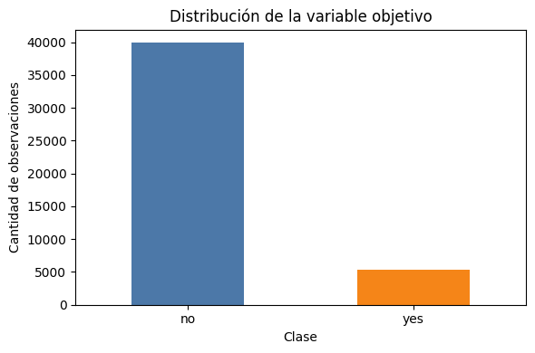
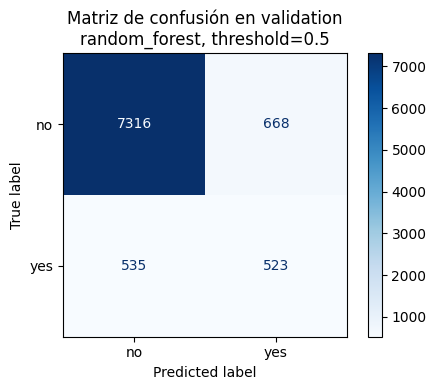
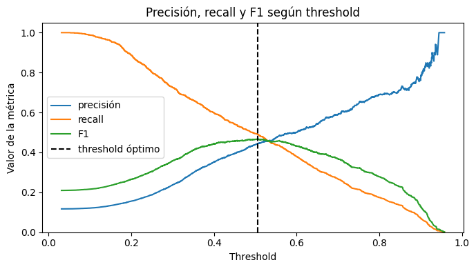
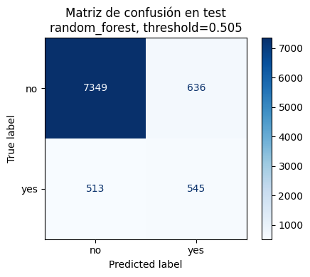

# Clasificación supervisada con Bank Marketing


<!-- WARNING: THIS FILE WAS AUTOGENERATED! DO NOT EDIT! -->

## 1. Introducción

En aprendizaje supervisado tenemos datos de entrada y una respuesta
conocida. El modelo observa muchos pares del tipo:

entradas → respuesta conocida

Luego intenta aprender una regla que permita estimar la respuesta para
casos nuevos.

La diferencia entre **clasificación** y **regresión** está en el tipo de
respuesta que queremos predecir:

- En **regresión**, la salida es numérica continua. Por ejemplo:
  predecir el precio de una vivienda.
- En **clasificación**, la salida es una categoría. Por ejemplo:
  predecir si un correo es spam o no spam.

En el caso del banco, no queremos predecir un monto continuo. Queremos
responder una pregunta de tipo sí/no: **¿esta persona aceptará el
producto?**

## 2. Definición del problema

Formalmente, nuestro problema queda definido así:

- **Entrada**: variables sobre la persona, su historial y el contacto
  realizado por el banco.
- **Salida**: la variable objetivo `y`.
- **Clase positiva**: `yes`, es decir, la persona contrató el depósito a
  plazo.
- **Clase negativa**: `no`, es decir, la persona no contrató el
  producto.

Como la variable objetivo solo tiene dos valores posibles, trabajaremos
con **clasificación binaria**. En código convertiremos `yes` a `1` y
`no` a `0`, porque muchas métricas y modelos esperan etiquetas
numéricas.

## 3. Dataset

Usaremos el dataset **Bank Marketing** del repositorio UCI Machine
Learning Repository. Este dataset contiene registros de campañas de
marketing directo de una institución bancaria portuguesa.

El dataset mezcla distintos tipos de variables:

- **Variables numéricas**: por ejemplo edad, balance o cantidad de
  contactos previos.
- **Variables categóricas**: por ejemplo trabajo, estado civil,
  educación o tipo de contacto.
- **Variable objetivo**: `y`, que indica si la persona contrató el
  depósito a plazo.

Una advertencia importante: la variable `duration` mide cuánto duró la
llamada. Esa información solo se conoce después de realizar el contacto,
por lo que usarla para predecir antes de llamar produciría **data
leakage**. La eliminaremos antes de entrenar los modelos.

## 4. Carga del dataset

Primero importamos las bibliotecas necesarias. Si `ucimlrepo` no está
instalado en el entorno, la celda intenta instalarlo usando
`%pip install ucimlrepo`. En el repositorio también declaramos esta
dependencia en `pyproject.toml`, por lo que en el Dev Container debería
estar disponible después de sincronizar el entorno.

``` python
import importlib.util

if importlib.util.find_spec("ucimlrepo") is None:
    print("Instalando ucimlrepo en el kernel actual...")


import numpy as np
import pandas as pd
import matplotlib.pyplot as plt

from IPython.display import display
from ucimlrepo import fetch_ucirepo

from sklearn.compose import ColumnTransformer
from sklearn.dummy import DummyClassifier
from sklearn.ensemble import RandomForestClassifier
from sklearn.impute import SimpleImputer
from sklearn.linear_model import LogisticRegression
from sklearn.metrics import (
    ConfusionMatrixDisplay,
    accuracy_score,
    average_precision_score,
    classification_report,
    confusion_matrix,
    f1_score,
    precision_recall_curve,
    precision_score,
    recall_score,
    roc_auc_score,
)
from sklearn.model_selection import GridSearchCV, StratifiedKFold, train_test_split
from sklearn.pipeline import Pipeline
from sklearn.preprocessing import OneHotEncoder, StandardScaler

RANDOM_STATE = 42
plt.style.use("default")
pd.set_option("display.max_columns", 80)
```

``` python
bank_marketing = fetch_ucirepo(id=222)

X_original = bank_marketing.data.features.copy()
y_original = bank_marketing.data.targets.copy()

df = pd.concat([X_original, y_original], axis=1)
variable_objetivo = y_original.columns[0]

print(f"Filas: {df.shape[0]:,}")
print(f"Columnas: {df.shape[1]:,}")
print(f"Variable objetivo: {variable_objetivo}")
```

    Filas: 45,211
    Columnas: 17
    Variable objetivo: y

``` python
metadata_variables = bank_marketing.variables
display(metadata_variables)
```

<div>
<style scoped>
    .dataframe tbody tr th:only-of-type {
        vertical-align: middle;
    }
&#10;    .dataframe tbody tr th {
        vertical-align: top;
    }
&#10;    .dataframe thead th {
        text-align: right;
    }
</style>

<table class="dataframe" data-quarto-postprocess="true" data-border="1">
<thead>
<tr style="text-align: right;">
<th data-quarto-table-cell-role="th"></th>
<th data-quarto-table-cell-role="th">name</th>
<th data-quarto-table-cell-role="th">role</th>
<th data-quarto-table-cell-role="th">type</th>
<th data-quarto-table-cell-role="th">demographic</th>
<th data-quarto-table-cell-role="th">description</th>
<th data-quarto-table-cell-role="th">units</th>
<th data-quarto-table-cell-role="th">missing_values</th>
</tr>
</thead>
<tbody>
<tr>
<td data-quarto-table-cell-role="th">0</td>
<td>age</td>
<td>Feature</td>
<td>Integer</td>
<td>Age</td>
<td>NaN</td>
<td>NaN</td>
<td>no</td>
</tr>
<tr>
<td data-quarto-table-cell-role="th">1</td>
<td>job</td>
<td>Feature</td>
<td>Categorical</td>
<td>Occupation</td>
<td>type of job (categorical: 'admin.','blue-colla...</td>
<td>NaN</td>
<td>no</td>
</tr>
<tr>
<td data-quarto-table-cell-role="th">2</td>
<td>marital</td>
<td>Feature</td>
<td>Categorical</td>
<td>Marital Status</td>
<td>marital status (categorical: 'divorced','marri...</td>
<td>NaN</td>
<td>no</td>
</tr>
<tr>
<td data-quarto-table-cell-role="th">3</td>
<td>education</td>
<td>Feature</td>
<td>Categorical</td>
<td>Education Level</td>
<td>(categorical: 'basic.4y','basic.6y','basic.9y'...</td>
<td>NaN</td>
<td>no</td>
</tr>
<tr>
<td data-quarto-table-cell-role="th">4</td>
<td>default</td>
<td>Feature</td>
<td>Binary</td>
<td>NaN</td>
<td>has credit in default?</td>
<td>NaN</td>
<td>no</td>
</tr>
<tr>
<td data-quarto-table-cell-role="th">5</td>
<td>balance</td>
<td>Feature</td>
<td>Integer</td>
<td>NaN</td>
<td>average yearly balance</td>
<td>euros</td>
<td>no</td>
</tr>
<tr>
<td data-quarto-table-cell-role="th">6</td>
<td>housing</td>
<td>Feature</td>
<td>Binary</td>
<td>NaN</td>
<td>has housing loan?</td>
<td>NaN</td>
<td>no</td>
</tr>
<tr>
<td data-quarto-table-cell-role="th">7</td>
<td>loan</td>
<td>Feature</td>
<td>Binary</td>
<td>NaN</td>
<td>has personal loan?</td>
<td>NaN</td>
<td>no</td>
</tr>
<tr>
<td data-quarto-table-cell-role="th">8</td>
<td>contact</td>
<td>Feature</td>
<td>Categorical</td>
<td>NaN</td>
<td>contact communication type (categorical: 'cell...</td>
<td>NaN</td>
<td>yes</td>
</tr>
<tr>
<td data-quarto-table-cell-role="th">9</td>
<td>day_of_week</td>
<td>Feature</td>
<td>Date</td>
<td>NaN</td>
<td>last contact day of the week</td>
<td>NaN</td>
<td>no</td>
</tr>
<tr>
<td data-quarto-table-cell-role="th">10</td>
<td>month</td>
<td>Feature</td>
<td>Date</td>
<td>NaN</td>
<td>last contact month of year (categorical: 'jan'...</td>
<td>NaN</td>
<td>no</td>
</tr>
<tr>
<td data-quarto-table-cell-role="th">11</td>
<td>duration</td>
<td>Feature</td>
<td>Integer</td>
<td>NaN</td>
<td>last contact duration, in seconds (numeric). ...</td>
<td>NaN</td>
<td>no</td>
</tr>
<tr>
<td data-quarto-table-cell-role="th">12</td>
<td>campaign</td>
<td>Feature</td>
<td>Integer</td>
<td>NaN</td>
<td>number of contacts performed during this campa...</td>
<td>NaN</td>
<td>no</td>
</tr>
<tr>
<td data-quarto-table-cell-role="th">13</td>
<td>pdays</td>
<td>Feature</td>
<td>Integer</td>
<td>NaN</td>
<td>number of days that passed by after the client...</td>
<td>NaN</td>
<td>yes</td>
</tr>
<tr>
<td data-quarto-table-cell-role="th">14</td>
<td>previous</td>
<td>Feature</td>
<td>Integer</td>
<td>NaN</td>
<td>number of contacts performed before this campa...</td>
<td>NaN</td>
<td>no</td>
</tr>
<tr>
<td data-quarto-table-cell-role="th">15</td>
<td>poutcome</td>
<td>Feature</td>
<td>Categorical</td>
<td>NaN</td>
<td>outcome of the previous marketing campaign (ca...</td>
<td>NaN</td>
<td>yes</td>
</tr>
<tr>
<td data-quarto-table-cell-role="th">16</td>
<td>y</td>
<td>Target</td>
<td>Binary</td>
<td>NaN</td>
<td>has the client subscribed a term deposit?</td>
<td>NaN</td>
<td>no</td>
</tr>
</tbody>
</table>

</div>

## 5. Inspección inicial

Antes de entrenar modelos, conviene mirar los datos con calma. En esta
etapa buscamos responder preguntas simples:

- ¿Cómo se ven las primeras filas?
- ¿Qué tipos de datos tiene cada columna?
- ¿Hay clases desbalanceadas?
- ¿Hay valores faltantes o duplicados?

Estas preguntas parecen básicas, pero evitan muchos errores posteriores.

``` python
df.head()
```

<div>
<style scoped>
    .dataframe tbody tr th:only-of-type {
        vertical-align: middle;
    }
&#10;    .dataframe tbody tr th {
        vertical-align: top;
    }
&#10;    .dataframe thead th {
        text-align: right;
    }
</style>

<table class="dataframe" data-quarto-postprocess="true" data-border="1">
<thead>
<tr style="text-align: right;">
<th data-quarto-table-cell-role="th"></th>
<th data-quarto-table-cell-role="th">age</th>
<th data-quarto-table-cell-role="th">job</th>
<th data-quarto-table-cell-role="th">marital</th>
<th data-quarto-table-cell-role="th">education</th>
<th data-quarto-table-cell-role="th">default</th>
<th data-quarto-table-cell-role="th">balance</th>
<th data-quarto-table-cell-role="th">housing</th>
<th data-quarto-table-cell-role="th">loan</th>
<th data-quarto-table-cell-role="th">contact</th>
<th data-quarto-table-cell-role="th">day_of_week</th>
<th data-quarto-table-cell-role="th">month</th>
<th data-quarto-table-cell-role="th">duration</th>
<th data-quarto-table-cell-role="th">campaign</th>
<th data-quarto-table-cell-role="th">pdays</th>
<th data-quarto-table-cell-role="th">previous</th>
<th data-quarto-table-cell-role="th">poutcome</th>
<th data-quarto-table-cell-role="th">y</th>
</tr>
</thead>
<tbody>
<tr>
<td data-quarto-table-cell-role="th">0</td>
<td>58</td>
<td>management</td>
<td>married</td>
<td>tertiary</td>
<td>no</td>
<td>2143</td>
<td>yes</td>
<td>no</td>
<td>NaN</td>
<td>5</td>
<td>may</td>
<td>261</td>
<td>1</td>
<td>-1</td>
<td>0</td>
<td>NaN</td>
<td>no</td>
</tr>
<tr>
<td data-quarto-table-cell-role="th">1</td>
<td>44</td>
<td>technician</td>
<td>single</td>
<td>secondary</td>
<td>no</td>
<td>29</td>
<td>yes</td>
<td>no</td>
<td>NaN</td>
<td>5</td>
<td>may</td>
<td>151</td>
<td>1</td>
<td>-1</td>
<td>0</td>
<td>NaN</td>
<td>no</td>
</tr>
<tr>
<td data-quarto-table-cell-role="th">2</td>
<td>33</td>
<td>entrepreneur</td>
<td>married</td>
<td>secondary</td>
<td>no</td>
<td>2</td>
<td>yes</td>
<td>yes</td>
<td>NaN</td>
<td>5</td>
<td>may</td>
<td>76</td>
<td>1</td>
<td>-1</td>
<td>0</td>
<td>NaN</td>
<td>no</td>
</tr>
<tr>
<td data-quarto-table-cell-role="th">3</td>
<td>47</td>
<td>blue-collar</td>
<td>married</td>
<td>NaN</td>
<td>no</td>
<td>1506</td>
<td>yes</td>
<td>no</td>
<td>NaN</td>
<td>5</td>
<td>may</td>
<td>92</td>
<td>1</td>
<td>-1</td>
<td>0</td>
<td>NaN</td>
<td>no</td>
</tr>
<tr>
<td data-quarto-table-cell-role="th">4</td>
<td>33</td>
<td>NaN</td>
<td>single</td>
<td>NaN</td>
<td>no</td>
<td>1</td>
<td>no</td>
<td>no</td>
<td>NaN</td>
<td>5</td>
<td>may</td>
<td>198</td>
<td>1</td>
<td>-1</td>
<td>0</td>
<td>NaN</td>
<td>no</td>
</tr>
</tbody>
</table>

</div>

``` python
df.info()
```

    <class 'pandas.DataFrame'>
    RangeIndex: 45211 entries, 0 to 45210
    Data columns (total 17 columns):
     #   Column       Non-Null Count  Dtype
    ---  ------       --------------  -----
     0   age          45211 non-null  int64
     1   job          44923 non-null  str  
     2   marital      45211 non-null  str  
     3   education    43354 non-null  str  
     4   default      45211 non-null  str  
     5   balance      45211 non-null  int64
     6   housing      45211 non-null  str  
     7   loan         45211 non-null  str  
     8   contact      32191 non-null  str  
     9   day_of_week  45211 non-null  int64
     10  month        45211 non-null  str  
     11  duration     45211 non-null  int64
     12  campaign     45211 non-null  int64
     13  pdays        45211 non-null  int64
     14  previous     45211 non-null  int64
     15  poutcome     8252 non-null   str  
     16  y            45211 non-null  str  
    dtypes: int64(7), str(10)
    memory usage: 5.9 MB

``` python
df.describe(include="all").T
```

<div>
<style scoped>
    .dataframe tbody tr th:only-of-type {
        vertical-align: middle;
    }
&#10;    .dataframe tbody tr th {
        vertical-align: top;
    }
&#10;    .dataframe thead th {
        text-align: right;
    }
</style>

<table class="dataframe" data-quarto-postprocess="true" data-border="1">
<thead>
<tr style="text-align: right;">
<th data-quarto-table-cell-role="th"></th>
<th data-quarto-table-cell-role="th">count</th>
<th data-quarto-table-cell-role="th">unique</th>
<th data-quarto-table-cell-role="th">top</th>
<th data-quarto-table-cell-role="th">freq</th>
<th data-quarto-table-cell-role="th">mean</th>
<th data-quarto-table-cell-role="th">std</th>
<th data-quarto-table-cell-role="th">min</th>
<th data-quarto-table-cell-role="th">25%</th>
<th data-quarto-table-cell-role="th">50%</th>
<th data-quarto-table-cell-role="th">75%</th>
<th data-quarto-table-cell-role="th">max</th>
</tr>
</thead>
<tbody>
<tr>
<td data-quarto-table-cell-role="th">age</td>
<td>45211.0</td>
<td>NaN</td>
<td>NaN</td>
<td>NaN</td>
<td>40.93621</td>
<td>10.618762</td>
<td>18.0</td>
<td>33.0</td>
<td>39.0</td>
<td>48.0</td>
<td>95.0</td>
</tr>
<tr>
<td data-quarto-table-cell-role="th">job</td>
<td>44923</td>
<td>11</td>
<td>blue-collar</td>
<td>9732</td>
<td>NaN</td>
<td>NaN</td>
<td>NaN</td>
<td>NaN</td>
<td>NaN</td>
<td>NaN</td>
<td>NaN</td>
</tr>
<tr>
<td data-quarto-table-cell-role="th">marital</td>
<td>45211</td>
<td>3</td>
<td>married</td>
<td>27214</td>
<td>NaN</td>
<td>NaN</td>
<td>NaN</td>
<td>NaN</td>
<td>NaN</td>
<td>NaN</td>
<td>NaN</td>
</tr>
<tr>
<td data-quarto-table-cell-role="th">education</td>
<td>43354</td>
<td>3</td>
<td>secondary</td>
<td>23202</td>
<td>NaN</td>
<td>NaN</td>
<td>NaN</td>
<td>NaN</td>
<td>NaN</td>
<td>NaN</td>
<td>NaN</td>
</tr>
<tr>
<td data-quarto-table-cell-role="th">default</td>
<td>45211</td>
<td>2</td>
<td>no</td>
<td>44396</td>
<td>NaN</td>
<td>NaN</td>
<td>NaN</td>
<td>NaN</td>
<td>NaN</td>
<td>NaN</td>
<td>NaN</td>
</tr>
<tr>
<td data-quarto-table-cell-role="th">balance</td>
<td>45211.0</td>
<td>NaN</td>
<td>NaN</td>
<td>NaN</td>
<td>1362.272058</td>
<td>3044.765829</td>
<td>-8019.0</td>
<td>72.0</td>
<td>448.0</td>
<td>1428.0</td>
<td>102127.0</td>
</tr>
<tr>
<td data-quarto-table-cell-role="th">housing</td>
<td>45211</td>
<td>2</td>
<td>yes</td>
<td>25130</td>
<td>NaN</td>
<td>NaN</td>
<td>NaN</td>
<td>NaN</td>
<td>NaN</td>
<td>NaN</td>
<td>NaN</td>
</tr>
<tr>
<td data-quarto-table-cell-role="th">loan</td>
<td>45211</td>
<td>2</td>
<td>no</td>
<td>37967</td>
<td>NaN</td>
<td>NaN</td>
<td>NaN</td>
<td>NaN</td>
<td>NaN</td>
<td>NaN</td>
<td>NaN</td>
</tr>
<tr>
<td data-quarto-table-cell-role="th">contact</td>
<td>32191</td>
<td>2</td>
<td>cellular</td>
<td>29285</td>
<td>NaN</td>
<td>NaN</td>
<td>NaN</td>
<td>NaN</td>
<td>NaN</td>
<td>NaN</td>
<td>NaN</td>
</tr>
<tr>
<td data-quarto-table-cell-role="th">day_of_week</td>
<td>45211.0</td>
<td>NaN</td>
<td>NaN</td>
<td>NaN</td>
<td>15.806419</td>
<td>8.322476</td>
<td>1.0</td>
<td>8.0</td>
<td>16.0</td>
<td>21.0</td>
<td>31.0</td>
</tr>
<tr>
<td data-quarto-table-cell-role="th">month</td>
<td>45211</td>
<td>12</td>
<td>may</td>
<td>13766</td>
<td>NaN</td>
<td>NaN</td>
<td>NaN</td>
<td>NaN</td>
<td>NaN</td>
<td>NaN</td>
<td>NaN</td>
</tr>
<tr>
<td data-quarto-table-cell-role="th">duration</td>
<td>45211.0</td>
<td>NaN</td>
<td>NaN</td>
<td>NaN</td>
<td>258.16308</td>
<td>257.527812</td>
<td>0.0</td>
<td>103.0</td>
<td>180.0</td>
<td>319.0</td>
<td>4918.0</td>
</tr>
<tr>
<td data-quarto-table-cell-role="th">campaign</td>
<td>45211.0</td>
<td>NaN</td>
<td>NaN</td>
<td>NaN</td>
<td>2.763841</td>
<td>3.098021</td>
<td>1.0</td>
<td>1.0</td>
<td>2.0</td>
<td>3.0</td>
<td>63.0</td>
</tr>
<tr>
<td data-quarto-table-cell-role="th">pdays</td>
<td>45211.0</td>
<td>NaN</td>
<td>NaN</td>
<td>NaN</td>
<td>40.197828</td>
<td>100.128746</td>
<td>-1.0</td>
<td>-1.0</td>
<td>-1.0</td>
<td>-1.0</td>
<td>871.0</td>
</tr>
<tr>
<td data-quarto-table-cell-role="th">previous</td>
<td>45211.0</td>
<td>NaN</td>
<td>NaN</td>
<td>NaN</td>
<td>0.580323</td>
<td>2.303441</td>
<td>0.0</td>
<td>0.0</td>
<td>0.0</td>
<td>0.0</td>
<td>275.0</td>
</tr>
<tr>
<td data-quarto-table-cell-role="th">poutcome</td>
<td>8252</td>
<td>3</td>
<td>failure</td>
<td>4901</td>
<td>NaN</td>
<td>NaN</td>
<td>NaN</td>
<td>NaN</td>
<td>NaN</td>
<td>NaN</td>
<td>NaN</td>
</tr>
<tr>
<td data-quarto-table-cell-role="th">y</td>
<td>45211</td>
<td>2</td>
<td>no</td>
<td>39922</td>
<td>NaN</td>
<td>NaN</td>
<td>NaN</td>
<td>NaN</td>
<td>NaN</td>
<td>NaN</td>
<td>NaN</td>
</tr>
</tbody>
</table>

</div>

``` python
conteo_clases = df[variable_objetivo].value_counts(dropna=False)
proporcion_clases = df[variable_objetivo].value_counts(normalize=True, dropna=False)

resumen_clases = pd.DataFrame({
    "n": conteo_clases,
    "proporción": proporcion_clases,
})
display(resumen_clases)
```

<div>
<style scoped>
    .dataframe tbody tr th:only-of-type {
        vertical-align: middle;
    }
&#10;    .dataframe tbody tr th {
        vertical-align: top;
    }
&#10;    .dataframe thead th {
        text-align: right;
    }
</style>

<table class="dataframe" data-quarto-postprocess="true" data-border="1">
<thead>
<tr style="text-align: right;">
<th data-quarto-table-cell-role="th"></th>
<th data-quarto-table-cell-role="th">n</th>
<th data-quarto-table-cell-role="th">proporción</th>
</tr>
<tr>
<th data-quarto-table-cell-role="th">y</th>
<th data-quarto-table-cell-role="th"></th>
<th data-quarto-table-cell-role="th"></th>
</tr>
</thead>
<tbody>
<tr>
<td data-quarto-table-cell-role="th">no</td>
<td>39922</td>
<td>0.883015</td>
</tr>
<tr>
<td data-quarto-table-cell-role="th">yes</td>
<td>5289</td>
<td>0.116985</td>
</tr>
</tbody>
</table>

</div>

``` python
fig, ax = plt.subplots(figsize=(6, 4))
resumen_clases["n"].plot(kind="bar", ax=ax, color=["#4C78A8", "#F58518"])
ax.set_title("Distribución de la variable objetivo")
ax.set_xlabel("Clase")
ax.set_ylabel("Cantidad de observaciones")
ax.tick_params(axis="x", rotation=0)
plt.tight_layout()
plt.show()
```



``` python
valores_faltantes = df.isna().sum().sort_values(ascending=False)
valores_faltantes = valores_faltantes[valores_faltantes > 0]

print(f"Columnas con valores faltantes reales: {len(valores_faltantes)}")
display(valores_faltantes.to_frame("faltantes"))

duplicados = df.duplicated().sum()
print(f"Filas duplicadas exactas: {duplicados:,}")
```

    Columnas con valores faltantes reales: 4

<div>
<style scoped>
    .dataframe tbody tr th:only-of-type {
        vertical-align: middle;
    }
&#10;    .dataframe tbody tr th {
        vertical-align: top;
    }
&#10;    .dataframe thead th {
        text-align: right;
    }
</style>

<table class="dataframe" data-quarto-postprocess="true" data-border="1">
<thead>
<tr style="text-align: right;">
<th data-quarto-table-cell-role="th"></th>
<th data-quarto-table-cell-role="th">faltantes</th>
</tr>
</thead>
<tbody>
<tr>
<td data-quarto-table-cell-role="th">poutcome</td>
<td>36959</td>
</tr>
<tr>
<td data-quarto-table-cell-role="th">contact</td>
<td>13020</td>
</tr>
<tr>
<td data-quarto-table-cell-role="th">education</td>
<td>1857</td>
</tr>
<tr>
<td data-quarto-table-cell-role="th">job</td>
<td>288</td>
</tr>
</tbody>
</table>

</div>

    Filas duplicadas exactas: 0

## 6. Preparación de datos

La preparación tiene varios pasos. Primero hacemos una limpieza básica.
Luego separamos entradas (`X`) y salida (`y`). Después eliminamos
`duration` para evitar data leakage.

También necesitamos tratar de forma distinta las variables numéricas y
categóricas:

- A las variables numéricas les aplicaremos imputación y escalamiento.
- A las variables categóricas les aplicaremos imputación y one-hot
  encoding.

Todo esto se integrará más adelante dentro de un `Pipeline`, para que el
mismo proceso se use durante entrenamiento y evaluación.

``` python
df_limpio = df.copy()

columnas_texto = df_limpio.select_dtypes(include="object").columns
for columna in columnas_texto:
    df_limpio[columna] = df_limpio[columna].astype("object").map(
        lambda valor: valor.strip().lower() if isinstance(valor, str) else valor
    )

df_limpio = df_limpio.replace({"unknown": np.nan, "": np.nan})
filas_antes = len(df_limpio)
df_limpio = df_limpio.drop_duplicates().reset_index(drop=True)
filas_despues = len(df_limpio)

print(f"Filas antes de eliminar duplicados exactos: {filas_antes:,}")
print(f"Filas después de eliminar duplicados exactos: {filas_despues:,}")
print(f"Filas eliminadas: {filas_antes - filas_despues:,}")
```

    Filas antes de eliminar duplicados exactos: 45,211
    Filas después de eliminar duplicados exactos: 45,211
    Filas eliminadas: 0

    /var/folders/n4/j3zj6_r13rv55gc2c5btztph0000gn/T/ipykernel_30646/2586486750.py:3: Pandas4Warning: For backward compatibility, 'str' dtypes are included by select_dtypes when 'object' dtype is specified. This behavior is deprecated and will be removed in a future version. Explicitly pass 'str' to `include` to select them, or to `exclude` to remove them and silence this warning.
    See https://pandas.pydata.org/docs/user_guide/migration-3-strings.html#string-migration-select-dtypes for details on how to write code that works with pandas 2 and 3.
      columnas_texto = df_limpio.select_dtypes(include="object").columns

``` python
mapeo_objetivo = {"no": 0, "yes": 1}
y = df_limpio[variable_objetivo].map(mapeo_objetivo).astype(int)
X = df_limpio.drop(columns=[variable_objetivo])

if "duration" in X.columns:
    X = X.drop(columns=["duration"])
    print("Se eliminó la columna 'duration' para evitar data leakage.")
else:
    print("No se encontró la columna 'duration'.")

variables_numericas = X.select_dtypes(include=["number"]).columns.tolist()
variables_categoricas = X.select_dtypes(exclude=["number"]).columns.tolist()

print(f"Variables numéricas ({len(variables_numericas)}): {variables_numericas}")
print(f"Variables categóricas ({len(variables_categoricas)}): {variables_categoricas}")
```

    Se eliminó la columna 'duration' para evitar data leakage.
    Variables numéricas (6): ['age', 'balance', 'day_of_week', 'campaign', 'pdays', 'previous']
    Variables categóricas (9): ['job', 'marital', 'education', 'default', 'housing', 'loan', 'contact', 'month', 'poutcome']

## 7. División del dataset

Separaremos los datos en tres subconjuntos:

- **Train (60%)**: se usa para ajustar los modelos y hacer validación
  cruzada.
- **Validation (20%)**: se usa para comparar modelos entrenados.
- **Test (20%)**: se reserva hasta el final para estimar desempeño en
  datos no usados durante la selección.

Usaremos `stratify` para conservar una proporción similar de clases en
cada subconjunto. Esto es importante cuando una clase es mucho menos
frecuente que la otra.

``` python
X_train, X_temp, y_train, y_temp = train_test_split(
    X,
    y,
    test_size=0.40,
    stratify=y,
    random_state=RANDOM_STATE,
)

X_val, X_test, y_val, y_test = train_test_split(
    X_temp,
    y_temp,
    test_size=0.50,
    stratify=y_temp,
    random_state=RANDOM_STATE,
)

resumen_split = pd.DataFrame({
    "filas": [len(X_train), len(X_val), len(X_test)],
    "proporción": [len(X_train) / len(X), len(X_val) / len(X), len(X_test) / len(X)],
    "tasa_clase_positiva": [y_train.mean(), y_val.mean(), y_test.mean()],
}, index=["train", "validation", "test"])

display(resumen_split)
```

<div>
<style scoped>
    .dataframe tbody tr th:only-of-type {
        vertical-align: middle;
    }
&#10;    .dataframe tbody tr th {
        vertical-align: top;
    }
&#10;    .dataframe thead th {
        text-align: right;
    }
</style>

<table class="dataframe" data-quarto-postprocess="true" data-border="1">
<thead>
<tr style="text-align: right;">
<th data-quarto-table-cell-role="th"></th>
<th data-quarto-table-cell-role="th">filas</th>
<th data-quarto-table-cell-role="th">proporción</th>
<th data-quarto-table-cell-role="th">tasa_clase_positiva</th>
</tr>
</thead>
<tbody>
<tr>
<td data-quarto-table-cell-role="th">train</td>
<td>27126</td>
<td>0.599987</td>
<td>0.116973</td>
</tr>
<tr>
<td data-quarto-table-cell-role="th">validation</td>
<td>9042</td>
<td>0.199996</td>
<td>0.117010</td>
</tr>
<tr>
<td data-quarto-table-cell-role="th">test</td>
<td>9043</td>
<td>0.200018</td>
<td>0.116997</td>
</tr>
</tbody>
</table>

</div>

## 8. Modelos

Entrenaremos tres modelos:

- **DummyClassifier**: baseline simple. Sirve para saber si un modelo
  real está aportando valor.
- **LogisticRegression**: modelo lineal clásico para clasificación
  binaria.
- **RandomForestClassifier**: ensamble de árboles de decisión, capaz de
  capturar relaciones no lineales.

El baseline es importante porque un dataset desbalanceado puede producir
una accuracy alta incluso con un modelo poco útil. Si la mayoría de las
personas responde `no`, un modelo que siempre predice `no` puede parecer
bueno por accuracy, aunque no detecte clientes interesados.

``` python
preprocesamiento_numerico = Pipeline(steps=[
    ("imputacion", SimpleImputer(strategy="median")),
    ("escalamiento", StandardScaler()),
])

preprocesamiento_categorico = Pipeline(steps=[
    ("imputacion", SimpleImputer(strategy="most_frequent")),
    ("one_hot", OneHotEncoder(handle_unknown="ignore", sparse_output=False)),
])

preprocesamiento = ColumnTransformer(
    transformers=[
        ("num", preprocesamiento_numerico, variables_numericas),
        ("cat", preprocesamiento_categorico, variables_categoricas),
    ]
)
```

## 9. Entrenamiento con Pipeline, GridSearchCV y StratifiedKFold

`Pipeline` nos permite unir preparación de datos y modelo en un solo
objeto. Esto reduce errores, porque evita preparar train y test de
formas distintas.

`GridSearchCV` prueba combinaciones de hiperparámetros. Usaremos
`StratifiedKFold` para que cada partición de validación cruzada conserve
la proporción de clases. Como criterio de búsqueda usaremos
`average_precision`, una métrica útil cuando la clase positiva es menos
frecuente.

``` python
modelos = {
    "dummy": {
        "estimador": DummyClassifier(random_state=RANDOM_STATE),
        "parametros": {
            "modelo__strategy": ["most_frequent", "stratified"],
        },
    },
    "regresión_logística": {
        "estimador": LogisticRegression(
            max_iter=1000,
            solver="liblinear",
            class_weight="balanced",
            random_state=RANDOM_STATE,
        ),
        "parametros": {
            "modelo__C": [0.1, 1.0, 10.0],
        },
    },
    "random_forest": {
        "estimador": RandomForestClassifier(
            n_estimators=120,
            class_weight="balanced_subsample",
            n_jobs=-1,
            random_state=RANDOM_STATE,
        ),
        "parametros": {
            "modelo__max_depth": [8, None],
            "modelo__min_samples_leaf": [1, 5],
        },
    },
}

cv = StratifiedKFold(n_splits=3, shuffle=True, random_state=RANDOM_STATE)
```

``` python
def construir_pipeline(estimador):
    return Pipeline(steps=[
        ("preprocesamiento", preprocesamiento),
        ("modelo", estimador),
    ])


def obtener_scores_positivos(modelo_entrenado, X_datos):
    indice_clase_positiva = list(modelo_entrenado.classes_).index(1)
    return modelo_entrenado.predict_proba(X_datos)[:, indice_clase_positiva]


def calcular_metricas(nombre, modelo_entrenado, X_datos, y_real, threshold=0.5):
    scores = obtener_scores_positivos(modelo_entrenado, X_datos)
    y_pred = (scores >= threshold).astype(int)
    return {
        "modelo": nombre,
        "threshold": threshold,
        "accuracy": accuracy_score(y_real, y_pred),
        "precision": precision_score(y_real, y_pred, zero_division=0),
        "recall": recall_score(y_real, y_pred, zero_division=0),
        "f1": f1_score(y_real, y_pred, zero_division=0),
        "roc_auc": roc_auc_score(y_real, scores),
        "average_precision": average_precision_score(y_real, scores),
    }
```

``` python
busquedas = {}
mejores_modelos = {}

for nombre, configuracion in modelos.items():
    print(f"Entrenando {nombre}...")
    pipeline = construir_pipeline(configuracion["estimador"])
    busqueda = GridSearchCV(
        estimator=pipeline,
        param_grid=configuracion["parametros"],
        scoring="average_precision",
        cv=cv,
        n_jobs=-1,
        refit=True,
    )
    busqueda.fit(X_train, y_train)
    busquedas[nombre] = busqueda
    mejores_modelos[nombre] = busqueda.best_estimator_
    print(f"  Mejor average precision CV: {busqueda.best_score_:.3f}")
    print(f"  Mejores parámetros: {busqueda.best_params_}")
```

    Entrenando dummy...
      Mejor average precision CV: 0.117
      Mejores parámetros: {'modelo__strategy': 'most_frequent'}
    Entrenando regresión_logística...
      Mejor average precision CV: 0.373
      Mejores parámetros: {'modelo__C': 0.1}
    Entrenando random_forest...
      Mejor average precision CV: 0.400
      Mejores parámetros: {'modelo__max_depth': None, 'modelo__min_samples_leaf': 5}

## 10. Métricas de evaluación

La **matriz de confusión** separa las predicciones en cuatro casos:

- **TP**: verdaderos positivos. El modelo predijo `yes` y la respuesta
  real era `yes`.
- **TN**: verdaderos negativos. El modelo predijo `no` y la respuesta
  real era `no`.
- **FP**: falsos positivos. El modelo predijo `yes`, pero la respuesta
  real era `no`.
- **FN**: falsos negativos. El modelo predijo `no`, pero la respuesta
  real era `yes`.

Las métricas principales son:

$$\text{Accuracy} = \frac{TP + TN}{TP + FP + FN + TN}$$

$$\text{Precisión} = \frac{TP}{TP + FP}$$

$$\text{Recall} = \frac{TP}{TP + FN}$$

$$\text{F1} = 2 \cdot \frac{\text{Precisión} \cdot \text{Recall}}{\text{Precisión} + \text{Recall}}$$

También usaremos **ROC AUC** y **Average Precision**. Estas métricas
trabajan con scores o probabilidades, no solo con una clase final. Por
eso son útiles para comparar modelos antes de elegir un umbral de
decisión.

## 11. Evaluación en validation

Ahora evaluamos los mejores modelos encontrados por `GridSearchCV`
usando el conjunto de validación. En esta primera comparación usamos el
umbral clásico `0.5`: si la probabilidad estimada de `yes` es al menos
0.5, predecimos clase positiva.

``` python
metricas_validacion = [
    calcular_metricas(nombre, modelo, X_val, y_val, threshold=0.5)
    for nombre, modelo in mejores_modelos.items()
]

tabla_validacion = (
    pd.DataFrame(metricas_validacion)
    .set_index("modelo")
    .sort_values("average_precision", ascending=False)
)

display(tabla_validacion.style.format("{:.3f}"))
```

<style type="text/css">
</style>

<table id="T_c4f43" data-quarto-postprocess="true">
<thead>
<tr>
<th class="blank level0" data-quarto-table-cell-role="th"> </th>
<th id="T_c4f43_level0_col0" class="col_heading level0 col0"
data-quarto-table-cell-role="th">threshold</th>
<th id="T_c4f43_level0_col1" class="col_heading level0 col1"
data-quarto-table-cell-role="th">accuracy</th>
<th id="T_c4f43_level0_col2" class="col_heading level0 col2"
data-quarto-table-cell-role="th">precision</th>
<th id="T_c4f43_level0_col3" class="col_heading level0 col3"
data-quarto-table-cell-role="th">recall</th>
<th id="T_c4f43_level0_col4" class="col_heading level0 col4"
data-quarto-table-cell-role="th">f1</th>
<th id="T_c4f43_level0_col5" class="col_heading level0 col5"
data-quarto-table-cell-role="th">roc_auc</th>
<th id="T_c4f43_level0_col6" class="col_heading level0 col6"
data-quarto-table-cell-role="th">average_precision</th>
</tr>
<tr>
<th class="index_name level0"
data-quarto-table-cell-role="th">modelo</th>
<th class="blank col0" data-quarto-table-cell-role="th"> </th>
<th class="blank col1" data-quarto-table-cell-role="th"> </th>
<th class="blank col2" data-quarto-table-cell-role="th"> </th>
<th class="blank col3" data-quarto-table-cell-role="th"> </th>
<th class="blank col4" data-quarto-table-cell-role="th"> </th>
<th class="blank col5" data-quarto-table-cell-role="th"> </th>
<th class="blank col6" data-quarto-table-cell-role="th"> </th>
</tr>
</thead>
<tbody>
<tr>
<td id="T_c4f43_level0_row0" class="row_heading level0 row0"
data-quarto-table-cell-role="th">random_forest</td>
<td id="T_c4f43_row0_col0" class="data row0 col0">0.500</td>
<td id="T_c4f43_row0_col1" class="data row0 col1">0.867</td>
<td id="T_c4f43_row0_col2" class="data row0 col2">0.439</td>
<td id="T_c4f43_row0_col3" class="data row0 col3">0.494</td>
<td id="T_c4f43_row0_col4" class="data row0 col4">0.465</td>
<td id="T_c4f43_row0_col5" class="data row0 col5">0.781</td>
<td id="T_c4f43_row0_col6" class="data row0 col6">0.435</td>
</tr>
<tr>
<td id="T_c4f43_level0_row1" class="row_heading level0 row1"
data-quarto-table-cell-role="th">regresión_logística</td>
<td id="T_c4f43_row1_col0" class="data row1 col0">0.500</td>
<td id="T_c4f43_row1_col1" class="data row1 col1">0.759</td>
<td id="T_c4f43_row1_col2" class="data row1 col2">0.263</td>
<td id="T_c4f43_row1_col3" class="data row1 col3">0.590</td>
<td id="T_c4f43_row1_col4" class="data row1 col4">0.364</td>
<td id="T_c4f43_row1_col5" class="data row1 col5">0.748</td>
<td id="T_c4f43_row1_col6" class="data row1 col6">0.387</td>
</tr>
<tr>
<td id="T_c4f43_level0_row2" class="row_heading level0 row2"
data-quarto-table-cell-role="th">dummy</td>
<td id="T_c4f43_row2_col0" class="data row2 col0">0.500</td>
<td id="T_c4f43_row2_col1" class="data row2 col1">0.883</td>
<td id="T_c4f43_row2_col2" class="data row2 col2">0.000</td>
<td id="T_c4f43_row2_col3" class="data row2 col3">0.000</td>
<td id="T_c4f43_row2_col4" class="data row2 col4">0.000</td>
<td id="T_c4f43_row2_col5" class="data row2 col5">0.500</td>
<td id="T_c4f43_row2_col6" class="data row2 col6">0.117</td>
</tr>
</tbody>
</table>

``` python
criterio_seleccion = "average_precision"
nombre_mejor_modelo = tabla_validacion[criterio_seleccion].idxmax()
mejor_modelo = mejores_modelos[nombre_mejor_modelo]

print(f"Mejor modelo según {criterio_seleccion}: {nombre_mejor_modelo}")
print("Parámetros seleccionados:")
print(busquedas[nombre_mejor_modelo].best_params_)
```

    Mejor modelo según average_precision: random_forest
    Parámetros seleccionados:
    {'modelo__max_depth': None, 'modelo__min_samples_leaf': 5}

``` python
scores_val = obtener_scores_positivos(mejor_modelo, X_val)
pred_val_05 = (scores_val >= 0.5).astype(int)

print(classification_report(y_val, pred_val_05, target_names=["no", "yes"], zero_division=0))

fig, ax = plt.subplots(figsize=(5, 4))
ConfusionMatrixDisplay.from_predictions(
    y_val,
    pred_val_05,
    display_labels=["no", "yes"],
    cmap="Blues",
    values_format="d",
    ax=ax,
)
ax.set_title(f"Matriz de confusión en validation\n{nombre_mejor_modelo}, threshold=0.5")
plt.tight_layout()
plt.show()
```

                  precision    recall  f1-score   support

              no       0.93      0.92      0.92      7984
             yes       0.44      0.49      0.47      1058

        accuracy                           0.87      9042
       macro avg       0.69      0.71      0.69      9042
    weighted avg       0.87      0.87      0.87      9042



## 12. Threshold tuning

Muchos clasificadores no producen directamente una decisión, sino un
**score** o una probabilidad. El **threshold** es el punto de corte que
transforma esa probabilidad en una clase.

Con threshold `0.5`, una observación se clasifica como `yes` si su
probabilidad estimada es al menos 50%. Pero ese valor no siempre es el
mejor. Si bajamos el threshold, el modelo predice más positivos: suele
subir el recall, pero puede bajar la precisión. Si subimos el threshold,
el modelo exige más evidencia para predecir `yes`: suele subir la
precisión, pero puede bajar el recall.

Aquí buscaremos el threshold que maximiza F1 en el conjunto de
validación.

``` python
precision_curve, recall_curve, thresholds = precision_recall_curve(y_val, scores_val)

precision_threshold = precision_curve[:-1]
recall_threshold = recall_curve[:-1]
f1_threshold = 2 * (precision_threshold * recall_threshold) / (
    precision_threshold + recall_threshold + 1e-12
)

indice_mejor_threshold = int(np.nanargmax(f1_threshold))
threshold_optimo = float(thresholds[indice_mejor_threshold])

print(f"Threshold que maximiza F1 en validación: {threshold_optimo:.3f}")
print(f"Precisión: {precision_threshold[indice_mejor_threshold]:.3f}")
print(f"Recall: {recall_threshold[indice_mejor_threshold]:.3f}")
print(f"F1: {f1_threshold[indice_mejor_threshold]:.3f}")
```

    Threshold que maximiza F1 en validación: 0.505
    Precisión: 0.445
    Recall: 0.492
    F1: 0.467

``` python
fig, ax = plt.subplots(figsize=(7, 4))
ax.plot(thresholds, precision_threshold, label="precisión")
ax.plot(thresholds, recall_threshold, label="recall")
ax.plot(thresholds, f1_threshold, label="F1")
ax.axvline(threshold_optimo, color="black", linestyle="--", label="threshold óptimo")
ax.set_title("Precisión, recall y F1 según threshold")
ax.set_xlabel("Threshold")
ax.set_ylabel("Valor de la métrica")
ax.set_ylim(0, 1.05)
ax.legend()
plt.tight_layout()
plt.show()
```



## 13. Evaluación final en test

El conjunto de test se usa una sola vez al final. Esto nos da una
estimación más honesta del desempeño esperado, porque test no participó
en el entrenamiento, en la búsqueda de hiperparámetros ni en la
selección del threshold.

Compararemos el mejor modelo con threshold `0.5` y con el threshold
ajustado en validación.

``` python
metricas_test_05 = calcular_metricas(
    f"{nombre_mejor_modelo}_threshold_0.5",
    mejor_modelo,
    X_test,
    y_test,
    threshold=0.5,
)

metricas_test_optimo = calcular_metricas(
    f"{nombre_mejor_modelo}_threshold_ajustado",
    mejor_modelo,
    X_test,
    y_test,
    threshold=threshold_optimo,
)

tabla_test = pd.DataFrame([metricas_test_05, metricas_test_optimo]).set_index("modelo")
display(tabla_test.style.format("{:.3f}"))
```

<style type="text/css">
</style>

<table id="T_fd45b" data-quarto-postprocess="true">
<thead>
<tr>
<th class="blank level0" data-quarto-table-cell-role="th"> </th>
<th id="T_fd45b_level0_col0" class="col_heading level0 col0"
data-quarto-table-cell-role="th">threshold</th>
<th id="T_fd45b_level0_col1" class="col_heading level0 col1"
data-quarto-table-cell-role="th">accuracy</th>
<th id="T_fd45b_level0_col2" class="col_heading level0 col2"
data-quarto-table-cell-role="th">precision</th>
<th id="T_fd45b_level0_col3" class="col_heading level0 col3"
data-quarto-table-cell-role="th">recall</th>
<th id="T_fd45b_level0_col4" class="col_heading level0 col4"
data-quarto-table-cell-role="th">f1</th>
<th id="T_fd45b_level0_col5" class="col_heading level0 col5"
data-quarto-table-cell-role="th">roc_auc</th>
<th id="T_fd45b_level0_col6" class="col_heading level0 col6"
data-quarto-table-cell-role="th">average_precision</th>
</tr>
<tr>
<th class="index_name level0"
data-quarto-table-cell-role="th">modelo</th>
<th class="blank col0" data-quarto-table-cell-role="th"> </th>
<th class="blank col1" data-quarto-table-cell-role="th"> </th>
<th class="blank col2" data-quarto-table-cell-role="th"> </th>
<th class="blank col3" data-quarto-table-cell-role="th"> </th>
<th class="blank col4" data-quarto-table-cell-role="th"> </th>
<th class="blank col5" data-quarto-table-cell-role="th"> </th>
<th class="blank col6" data-quarto-table-cell-role="th"> </th>
</tr>
</thead>
<tbody>
<tr>
<td id="T_fd45b_level0_row0" class="row_heading level0 row0"
data-quarto-table-cell-role="th">random_forest_threshold_0.5</td>
<td id="T_fd45b_row0_col0" class="data row0 col0">0.500</td>
<td id="T_fd45b_row0_col1" class="data row0 col1">0.872</td>
<td id="T_fd45b_row0_col2" class="data row0 col2">0.459</td>
<td id="T_fd45b_row0_col3" class="data row0 col3">0.524</td>
<td id="T_fd45b_row0_col4" class="data row0 col4">0.489</td>
<td id="T_fd45b_row0_col5" class="data row0 col5">0.790</td>
<td id="T_fd45b_row0_col6" class="data row0 col6">0.466</td>
</tr>
<tr>
<td id="T_fd45b_level0_row1" class="row_heading level0 row1"
data-quarto-table-cell-role="th">random_forest_threshold_ajustado</td>
<td id="T_fd45b_row1_col0" class="data row1 col0">0.505</td>
<td id="T_fd45b_row1_col1" class="data row1 col1">0.873</td>
<td id="T_fd45b_row1_col2" class="data row1 col2">0.461</td>
<td id="T_fd45b_row1_col3" class="data row1 col3">0.515</td>
<td id="T_fd45b_row1_col4" class="data row1 col4">0.487</td>
<td id="T_fd45b_row1_col5" class="data row1 col5">0.790</td>
<td id="T_fd45b_row1_col6" class="data row1 col6">0.466</td>
</tr>
</tbody>
</table>

``` python
scores_test = obtener_scores_positivos(mejor_modelo, X_test)
pred_test_optimo = (scores_test >= threshold_optimo).astype(int)

print(classification_report(y_test, pred_test_optimo, target_names=["no", "yes"], zero_division=0))

fig, ax = plt.subplots(figsize=(5, 4))
ConfusionMatrixDisplay.from_predictions(
    y_test,
    pred_test_optimo,
    display_labels=["no", "yes"],
    cmap="Blues",
    values_format="d",
    ax=ax,
)
ax.set_title(f"Matriz de confusión en test\n{nombre_mejor_modelo}, threshold={threshold_optimo:.3f}")
plt.tight_layout()
plt.show()
```

                  precision    recall  f1-score   support

              no       0.93      0.92      0.93      7985
             yes       0.46      0.52      0.49      1058

        accuracy                           0.87      9043
       macro avg       0.70      0.72      0.71      9043
    weighted avg       0.88      0.87      0.88      9043



## 14. Interpretación del mejor modelo

La interpretación depende del tipo de modelo seleccionado. En una
regresión logística podemos mirar coeficientes; en un random forest
podemos mirar importancias de variables. Estas técnicas no explican todo
el comportamiento del modelo, pero ayudan a revisar que señales parecen
estar influyendo más en la predicción.

``` python
def extraer_importancias(modelo_entrenado, n=15):
    nombres_variables = modelo_entrenado.named_steps["preprocesamiento"].get_feature_names_out()
    estimador = modelo_entrenado.named_steps["modelo"]

    if hasattr(estimador, "feature_importances_"):
        valores = estimador.feature_importances_
        columna_valor = "importancia"
    elif hasattr(estimador, "coef_"):
        valores = estimador.coef_.ravel()
        columna_valor = "coeficiente"
    else:
        return pd.DataFrame()

    tabla = pd.DataFrame({
        "variable_transformada": nombres_variables,
        columna_valor: valores,
        "magnitud_absoluta": np.abs(valores),
    })
    return tabla.sort_values("magnitud_absoluta", ascending=False).head(n)


tabla_importancias = extraer_importancias(mejor_modelo)

if tabla_importancias.empty:
    print("El modelo seleccionado no expone coeficientes ni importancias de variables.")
else:
    display(tabla_importancias)
```

<div>
<style scoped>
    .dataframe tbody tr th:only-of-type {
        vertical-align: middle;
    }
&#10;    .dataframe tbody tr th {
        vertical-align: top;
    }
&#10;    .dataframe thead th {
        text-align: right;
    }
</style>

<table class="dataframe" data-quarto-postprocess="true" data-border="1">
<thead>
<tr style="text-align: right;">
<th data-quarto-table-cell-role="th"></th>
<th data-quarto-table-cell-role="th">variable_transformada</th>
<th data-quarto-table-cell-role="th">importancia</th>
<th data-quarto-table-cell-role="th">magnitud_absoluta</th>
</tr>
</thead>
<tbody>
<tr>
<td data-quarto-table-cell-role="th">1</td>
<td>num__balance</td>
<td>0.136545</td>
<td>0.136545</td>
</tr>
<tr>
<td data-quarto-table-cell-role="th">0</td>
<td>num__age</td>
<td>0.123285</td>
<td>0.123285</td>
</tr>
<tr>
<td data-quarto-table-cell-role="th">2</td>
<td>num__day_of_week</td>
<td>0.106219</td>
<td>0.106219</td>
</tr>
<tr>
<td data-quarto-table-cell-role="th">4</td>
<td>num__pdays</td>
<td>0.061216</td>
<td>0.061216</td>
</tr>
<tr>
<td data-quarto-table-cell-role="th">3</td>
<td>num__campaign</td>
<td>0.057229</td>
<td>0.057229</td>
</tr>
<tr>
<td data-quarto-table-cell-role="th">45</td>
<td>cat__poutcome_success</td>
<td>0.054210</td>
<td>0.054210</td>
</tr>
<tr>
<td data-quarto-table-cell-role="th">43</td>
<td>cat__poutcome_failure</td>
<td>0.038052</td>
<td>0.038052</td>
</tr>
<tr>
<td data-quarto-table-cell-role="th">25</td>
<td>cat__housing_no</td>
<td>0.031784</td>
<td>0.031784</td>
</tr>
<tr>
<td data-quarto-table-cell-role="th">26</td>
<td>cat__housing_yes</td>
<td>0.028489</td>
<td>0.028489</td>
</tr>
<tr>
<td data-quarto-table-cell-role="th">5</td>
<td>num__previous</td>
<td>0.027163</td>
<td>0.027163</td>
</tr>
<tr>
<td data-quarto-table-cell-role="th">39</td>
<td>cat__month_may</td>
<td>0.023907</td>
<td>0.023907</td>
</tr>
<tr>
<td data-quarto-table-cell-role="th">31</td>
<td>cat__month_apr</td>
<td>0.020038</td>
<td>0.020038</td>
</tr>
<tr>
<td data-quarto-table-cell-role="th">41</td>
<td>cat__month_oct</td>
<td>0.019333</td>
<td>0.019333</td>
</tr>
<tr>
<td data-quarto-table-cell-role="th">18</td>
<td>cat__marital_married</td>
<td>0.017157</td>
<td>0.017157</td>
</tr>
<tr>
<td data-quarto-table-cell-role="th">38</td>
<td>cat__month_mar</td>
<td>0.014339</td>
<td>0.014339</td>
</tr>
</tbody>
</table>

</div>

## 15. Análisis final

En esta unidad construimos un flujo completo de clasificación
supervisada: carga de datos, inspección, preparación, división
train/validation/test, entrenamiento con pipelines, búsqueda de
hiperparámetros, evaluación y ajuste de threshold.

El **DummyClassifier** funciona como baseline. Si un modelo real no
supera claramente al baseline, probablemente no está aprendiendo una
señal útil. En problemas desbalanceados, este punto es especialmente
importante porque la accuracy puede ser engañosa: un modelo que predice
casi siempre `no` puede obtener una accuracy aparentemente alta, pero
detectar muy pocos clientes que realmente aceptarían la oferta.

La tensión principal está entre **precisión** y **recall**. Si el banco
quiere evitar contactar personas con baja probabilidad de aceptar,
podría priorizar precisión: menos falsos positivos, pero también menos
oportunidades detectadas. Si el banco quiere no perder clientes
potencialmente interesados, podría priorizar recall: menos falsos
negativos, aunque con más contactos que no terminarán en conversión.

Los **falsos positivos** representan personas que el modelo marca como
interesadas, pero que no aceptan. Esto puede traducirse en costos
operativos, llamadas innecesarias o mala experiencia del cliente. Los
**falsos negativos** representan personas que sí habrían aceptado, pero
el modelo no identifica. Esto implica oportunidades comerciales
perdidas.

También vimos una limitación importante: no todas las variables
disponibles son válidas para predecir antes de actuar. La columna
`duration` fue eliminada porque solo se conoce después de la llamada.
Esta decisión muestra que construir modelos no es solo aplicar
algoritmos: también requiere entender el contexto, el momento en que
cada dato está disponible y el costo de cada tipo de error.

En una aplicación real, el siguiente paso sería discutir con el área de
negocio qué error duele más, revisar sesgos potenciales, monitorear
desempeño en el tiempo y validar que el modelo mejore decisiones reales,
no solo métricas offline.

## Referencias

Géron, A. (2019). *Hands-on machine learning with Scikit-Learn, Keras,
and TensorFlow: Concepts, tools, and techniques to build intelligent
systems* (2nd ed.). O’Reilly Media.
https://www.oreilly.com/library/view/hands-on-machine-learning/9781492032632/

Moro, S., Cortez, P., & Rita, P. (2014). A data-driven approach to
predict the success of bank telemarketing. *Decision Support Systems,
62*, 22-31. https://doi.org/10.1016/j.dss.2014.03.001

UCI Machine Learning Repository. (n.d.). *Bank Marketing*. University of
California, Irvine.
https://archive.ics.uci.edu/dataset/222/bank+marketing

Jolibois, C. (2023). *ucimlrepo: UCI Machine Learning Repository Python
package*. https://github.com/uci-ml-repo/ucimlrepo

Scikit-learn developers. (2024).
*sklearn.model_selection.train_test_split*. Scikit-learn documentation.
https://scikit-learn.org/stable/modules/generated/sklearn.model_selection.train_test_split.html

Scikit-learn developers. (2024). *sklearn.model_selection.GridSearchCV*.
Scikit-learn documentation.
https://scikit-learn.org/stable/modules/generated/sklearn.model_selection.GridSearchCV.html

Scikit-learn developers. (2024). *sklearn.dummy.DummyClassifier*.
Scikit-learn documentation.
https://scikit-learn.org/stable/modules/generated/sklearn.dummy.DummyClassifier.html

Scikit-learn developers. (2024).
*sklearn.linear_model.LogisticRegression*. Scikit-learn documentation.
https://scikit-learn.org/stable/modules/generated/sklearn.linear_model.LogisticRegression.html

Scikit-learn developers. (2024).
*sklearn.ensemble.RandomForestClassifier*. Scikit-learn documentation.
https://scikit-learn.org/stable/modules/generated/sklearn.ensemble.RandomForestClassifier.html

Scikit-learn developers. (2024).
*sklearn.metrics.classification_report*. Scikit-learn documentation.
https://scikit-learn.org/stable/modules/generated/sklearn.metrics.classification_report.html

Scikit-learn developers. (2024).
*sklearn.metrics.precision_recall_curve*. Scikit-learn documentation.
https://scikit-learn.org/stable/modules/generated/sklearn.metrics.precision_recall_curve.html
