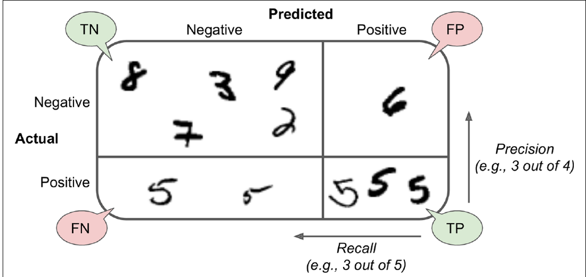
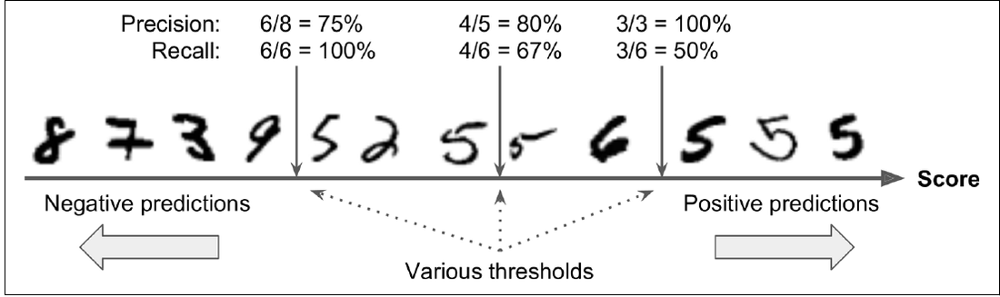
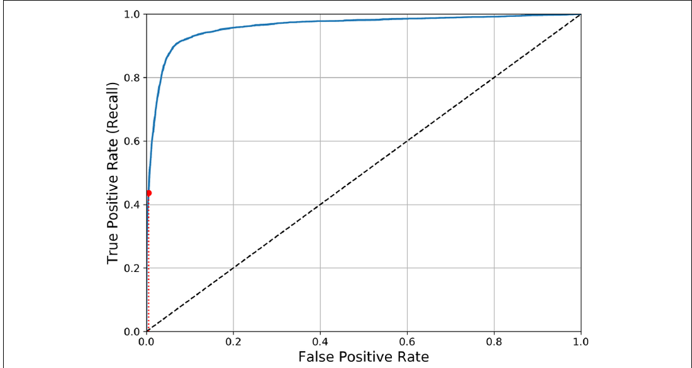

# Métricas de clasificación binaria con dígitos


<!-- WARNING: THIS FILE WAS AUTOGENERATED! DO NOT EDIT! -->

## 1. Problema: detectar si una imagen es un 5

Tomaremos el dataset `load_digits` de scikit-learn y construiremos una
etiqueta binaria:

- `True`: la imagen real es un `5`.
- `False`: la imagen real no es un `5`.

Este cambio convierte un problema multiclase en un problema binario. Ya
no preguntamos “¿qué dígito es?”, sino “¿pertenece a la clase positiva
5?”.

``` python
import numpy as np
import pandas as pd
import matplotlib.pyplot as plt

from IPython.display import display

from sklearn.datasets import load_digits
from sklearn.ensemble import RandomForestClassifier
from sklearn.linear_model import SGDClassifier
from sklearn.metrics import (
    ConfusionMatrixDisplay,
    accuracy_score,
    average_precision_score,
    classification_report,
    confusion_matrix,
    f1_score,
    precision_recall_curve,
    precision_score,
    recall_score,
    roc_auc_score,
    roc_curve,
)
from sklearn.model_selection import train_test_split
from sklearn.pipeline import Pipeline
from sklearn.preprocessing import StandardScaler

RANDOM_STATE = 42
plt.style.use("default")
```

``` python
digits = load_digits()
X = digits.data
y_multiclase = digits.target
y_es_5 = y_multiclase == 5
imagenes = digits.images

print(f"Observaciones: {X.shape[0]:,}")
print(f"Variables por imagen: {X.shape[1]}")
print(f"Cantidad de imágenes que son 5: {y_es_5.sum():,}")
print(f"Proporción de clase positiva: {y_es_5.mean():.3f}")
```

La clase positiva es relativamente minoritaria: solo una parte de las
imágenes son `5`. Esto es importante porque un modelo podría obtener una
accuracy alta prediciendo casi siempre “no es 5”. Por eso necesitamos
mirar más métricas.

``` python
fig, axes = plt.subplots(2, 5, figsize=(9, 4))
indices_5 = np.where(y_es_5)[0][:5]
indices_no_5 = np.where(~y_es_5)[0][:5]
indices = np.concatenate([indices_5, indices_no_5])

for indice, ax in zip(indices, axes.ravel()):
    ax.imshow(imagenes[indice], cmap="gray_r")
    etiqueta = "5" if y_es_5[indice] else "no 5"
    ax.set_title(etiqueta)
    ax.axis("off")

plt.tight_layout()
plt.show()
```

## 2. Entrenamiento y prueba

Separaremos los datos en entrenamiento y prueba. Usaremos
`stratify=y_es_5` para mantener una proporción similar de imágenes `5` y
`no 5` en ambos conjuntos.

El conjunto de prueba se reserva para evaluar predicciones en ejemplos
que el modelo no usó para aprender.

``` python
X_train, X_test, y_train, y_test, imagenes_train, imagenes_test = train_test_split(
    X,
    y_es_5,
    imagenes,
    test_size=0.25,
    stratify=y_es_5,
    random_state=RANDOM_STATE,
)

resumen = pd.DataFrame({
    "filas": [len(X_train), len(X_test)],
    "proporción_positiva": [y_train.mean(), y_test.mean()],
}, index=["train", "test"])

display(resumen)
```

## 3. Un primer clasificador binario

Entrenaremos un `SGDClassifier`. Este modelo puede entregar una
predicción final con `.predict()`, pero también puede entregar un
**score de decisión** con `.decision_function()`.

El score es clave para entender umbrales: una observación con score más
alto tiene más evidencia a favor de la clase positiva según el modelo.

``` python
clasificador_sgd = Pipeline(steps=[
    ("escalamiento", StandardScaler()),
    ("modelo", SGDClassifier(random_state=RANDOM_STATE)),
])

clasificador_sgd.fit(X_train, y_train)
y_pred_sgd = clasificador_sgd.predict(X_test)
scores_sgd = clasificador_sgd.decision_function(X_test)

print(f"Primeros scores: {np.round(scores_sgd[:10], 2)}")
print(f"Primeras predicciones: {y_pred_sgd[:10]}")
```

Por defecto, el clasificador convierte scores en clases usando su regla
interna de decisión. En un modelo lineal como este, un score mayor que
cero suele quedar del lado positivo. Más adelante cambiaremos
manualmente ese umbral para observar qué ocurre.

## 4. Matriz de confusión binaria

La matriz de confusión binaria organiza los resultados en cuatro celdas.
La figura del libro resume la lógica visualmente.

<figure>

<figcaption aria-hidden="true">Matriz de confusión binaria
ilustrada</figcaption>
</figure>

En nuestro caso, positivo significa “es un 5”. Por lo tanto:

- `TP`: imágenes que eran `5` y fueron predichas como `5`.
- `FP`: imágenes que no eran `5`, pero fueron predichas como `5`.
- `TN`: imágenes que no eran `5` y fueron predichas como `no 5`.
- `FN`: imágenes que eran `5`, pero fueron predichas como `no 5`.

``` python
cm = confusion_matrix(y_test, y_pred_sgd)
cm_df = pd.DataFrame(cm, index=["real_no_5", "real_5"], columns=["pred_no_5", "pred_5"])
display(cm_df)

fig, ax = plt.subplots(figsize=(5, 4))
ConfusionMatrixDisplay.from_predictions(
    y_test,
    y_pred_sgd,
    display_labels=["no 5", "5"],
    cmap="Blues",
    values_format="d",
    ax=ax,
)
ax.set_title("Matriz de confusión - detector de 5")
plt.tight_layout()
plt.show()
```

``` python
tn, fp, fn, tp = cm.ravel()
print(f"TN: {tn}")
print(f"FP: {fp}")
print(f"FN: {fn}")
print(f"TP: {tp}")
```

Estos cuatro valores son la base de varias métricas. La accuracy mira
todos los aciertos. La precisión se concentra en las predicciones
positivas. El recall se concentra en los positivos reales.

## 5. Accuracy, precisión, recall y F1-score

Calculemos las métricas principales para el detector de `5`.

Recuerda las preguntas:

- **Accuracy**: ¿qué proporción total de predicciones fue correcta?
- **Precisión**: cuando el modelo dijo “es 5”, ¿cuántas veces acertó?
- **Recall**: de todos los `5` reales, ¿cuántos encontró?
- **F1-score**: ¿qué tan equilibradas están precisión y recall?

``` python
metricas_sgd = pd.DataFrame([{
    "accuracy": accuracy_score(y_test, y_pred_sgd),
    "precision": precision_score(y_test, y_pred_sgd, zero_division=0),
    "recall": recall_score(y_test, y_pred_sgd, zero_division=0),
    "f1": f1_score(y_test, y_pred_sgd, zero_division=0),
}], index=["SGDClassifier"])

display(metricas_sgd.style.format("{:.3f}"))
print(classification_report(y_test, y_pred_sgd, target_names=["no 5", "5"], zero_division=0))
```

Si la accuracy es alta, revisa igualmente precisión y recall. En este
problema hay muchos más `no 5` que `5`, por lo que los aciertos sobre la
clase negativa pueden dominar la accuracy.

## 6. Umbral de decisión y trade-off precisión-recall

El capítulo base muestra que mover el umbral cambia el equilibrio entre
precisión y recall.

<figure>

<figcaption aria-hidden="true">Trade-off entre precisión y recall según
el umbral de decisión</figcaption>
</figure>

Usaremos los scores del modelo para probar distintos umbrales. Un umbral
más alto exige más evidencia para decir “es 5”. Un umbral más bajo hace
que el modelo prediga más positivos.

``` python
def metricas_para_umbral(threshold):
    y_pred_threshold = scores_sgd >= threshold
    return {
        "threshold": threshold,
        "positivos_predichos": int(y_pred_threshold.sum()),
        "precision": precision_score(y_test, y_pred_threshold, zero_division=0),
        "recall": recall_score(y_test, y_pred_threshold, zero_division=0),
        "f1": f1_score(y_test, y_pred_threshold, zero_division=0),
    }

thresholds_a_probar = [-5, 0, 5, 10]
tabla_thresholds = pd.DataFrame([metricas_para_umbral(t) for t in thresholds_a_probar])
display(tabla_thresholds.style.format({"precision": "{:.3f}", "recall": "{:.3f}", "f1": "{:.3f}"}))
```

Observa cómo cambia la cantidad de positivos predichos. Cuando el umbral
sube, normalmente hay menos predicciones positivas. Eso puede mejorar la
precisión, pero también puede dejar fuera algunos `5` reales y bajar el
recall.

## 7. Curva precision-recall

La curva precision-recall resume el comportamiento del clasificador para
muchos umbrales posibles. Es útil cuando la clase positiva es poco
frecuente o cuando nos interesa especialmente la calidad de las
predicciones positivas.

``` python
precisions, recalls, pr_thresholds = precision_recall_curve(y_test, scores_sgd)
average_precision = average_precision_score(y_test, scores_sgd)

fig, ax = plt.subplots(figsize=(6, 4))
ax.plot(recalls, precisions, color="#4C78A8")
ax.set_title(f"Curva precision-recall (AP={average_precision:.3f})")
ax.set_xlabel("Recall")
ax.set_ylabel("Precisión")
ax.set_xlim(0, 1.02)
ax.set_ylim(0, 1.02)
ax.grid(True, alpha=0.3)
plt.tight_layout()
plt.show()
```

Cada punto de la curva representa un umbral distinto. Una curva más
cercana a la esquina superior derecha indica un mejor equilibrio: alto
recall y alta precisión al mismo tiempo.

``` python
precision_threshold = precisions[:-1]
recall_threshold = recalls[:-1]
f1_threshold = 2 * precision_threshold * recall_threshold / (precision_threshold + recall_threshold + 1e-12)
mejor_indice = int(np.nanargmax(f1_threshold))
threshold_f1 = float(pr_thresholds[mejor_indice])

print(f"Threshold que maximiza F1 en test: {threshold_f1:.3f}")
print(f"Precisión: {precision_threshold[mejor_indice]:.3f}")
print(f"Recall: {recall_threshold[mejor_indice]:.3f}")
print(f"F1: {f1_threshold[mejor_indice]:.3f}")
```

## 8. Curva ROC y AUC

La curva ROC grafica la tasa de verdaderos positivos contra la tasa de
falsos positivos. La figura del libro muestra la intuición: una curva
más cerca de la esquina superior izquierda indica mejor separación entre
positivos y negativos.

<figure>

<figcaption aria-hidden="true">Curva ROC para un clasificador
binario</figcaption>
</figure>

El AUC resume el área bajo esa curva. Un valor cercano a `1.0` indica
buena separación; un valor cercano a `0.5` se parece a una decisión
aleatoria.

``` python
fpr_sgd, tpr_sgd, roc_thresholds = roc_curve(y_test, scores_sgd)
auc_sgd = roc_auc_score(y_test, scores_sgd)

fig, ax = plt.subplots(figsize=(6, 4))
ax.plot(fpr_sgd, tpr_sgd, label=f"SGDClassifier (AUC={auc_sgd:.3f})")
ax.plot([0, 1], [0, 1], "k--", label="azar")
ax.set_title("Curva ROC")
ax.set_xlabel("False Positive Rate")
ax.set_ylabel("True Positive Rate / Recall")
ax.set_xlim(0, 1)
ax.set_ylim(0, 1.02)
ax.legend()
ax.grid(True, alpha=0.3)
plt.tight_layout()
plt.show()
```

ROC y precision-recall miran el problema desde ángulos distintos. En
clases muy desbalanceadas, la curva precision-recall suele mostrar con
más claridad si las predicciones positivas son confiables.

## 9. Comparación con Random Forest

Para cerrar, comparemos el `SGDClassifier` con un
`RandomForestClassifier`. El bosque no usa `decision_function`, pero sí
puede entregar probabilidades con `.predict_proba()`. Usaremos la
probabilidad de la clase positiva como score.

``` python
random_forest = RandomForestClassifier(
    n_estimators=200,
    random_state=RANDOM_STATE,
    n_jobs=-1,
)
random_forest.fit(X_train, y_train)

y_pred_rf = random_forest.predict(X_test)
scores_rf = random_forest.predict_proba(X_test)[:, 1]

comparacion = pd.DataFrame([
    {
        "modelo": "SGDClassifier",
        "accuracy": accuracy_score(y_test, y_pred_sgd),
        "precision": precision_score(y_test, y_pred_sgd, zero_division=0),
        "recall": recall_score(y_test, y_pred_sgd, zero_division=0),
        "f1": f1_score(y_test, y_pred_sgd, zero_division=0),
        "roc_auc": roc_auc_score(y_test, scores_sgd),
        "average_precision": average_precision_score(y_test, scores_sgd),
    },
    {
        "modelo": "RandomForestClassifier",
        "accuracy": accuracy_score(y_test, y_pred_rf),
        "precision": precision_score(y_test, y_pred_rf, zero_division=0),
        "recall": recall_score(y_test, y_pred_rf, zero_division=0),
        "f1": f1_score(y_test, y_pred_rf, zero_division=0),
        "roc_auc": roc_auc_score(y_test, scores_rf),
        "average_precision": average_precision_score(y_test, scores_rf),
    },
]).set_index("modelo")

display(comparacion.style.format("{:.3f}"))
```

``` python
fpr_rf, tpr_rf, _ = roc_curve(y_test, scores_rf)

fig, ax = plt.subplots(figsize=(6, 4))
ax.plot(fpr_sgd, tpr_sgd, label=f"SGD (AUC={auc_sgd:.3f})")
ax.plot(fpr_rf, tpr_rf, label=f"Random Forest (AUC={roc_auc_score(y_test, scores_rf):.3f})")
ax.plot([0, 1], [0, 1], "k--", label="azar")
ax.set_title("Comparación de curvas ROC")
ax.set_xlabel("False Positive Rate")
ax.set_ylabel("True Positive Rate / Recall")
ax.legend()
ax.grid(True, alpha=0.3)
plt.tight_layout()
plt.show()
```

La comparación no debe quedarse solo en una métrica. Si un modelo tiene
mayor AUC, también conviene revisar precisión, recall, F1 y la matriz de
confusión al umbral que realmente se usará. La mejor elección depende
del costo de los falsos positivos y falsos negativos.

## 10. Actividad práctica

1.  Cambia el dígito positivo: usa `y_multiclase == 3` o
    `y_multiclase == 8`. ¿Cambian las métricas?
2.  Prueba otros umbrales y explica cómo cambian precisión y recall.
3.  Elige un umbral que priorice recall. ¿Qué costo tiene en falsos
    positivos?
4.  Elige un umbral que priorice precisión. ¿Qué costo tiene en falsos
    negativos?
5.  Compara `SGDClassifier` y `RandomForestClassifier` usando F1, curva
    precision-recall y ROC AUC.
6.  Escribe una conclusión breve: si el objetivo fuera no perder ningún
    `5`, ¿qué métrica priorizarías? ¿Y si el objetivo fuera evitar
    falsas alarmas?

## 11. Conclusiones

En esta actividad convertimos un problema multiclase en una pregunta
binaria: detectar si una imagen es un `5`. Esta transformación nos
permitió estudiar con más claridad los cuatro tipos de resultado de una
matriz de confusión binaria: TP, FP, TN y FN.

También vimos que accuracy no siempre basta. Precisión, recall y
F1-score responden preguntas distintas, y el umbral de decisión permite
mover el equilibrio entre detectar más positivos o ser más estricto al
declarar una predicción positiva.

Finalmente, las curvas precision-recall y ROC permiten evaluar modelos a
través de muchos umbrales posibles. AUC resume la curva ROC, pero la
interpretación siempre debe conectarse con el problema: qué error cuesta
más y qué decisión se tomará con el modelo.

## Referencias

Géron, A. (2019). *Hands-on machine learning with Scikit-Learn, Keras,
and TensorFlow: Concepts, tools, and techniques to build intelligent
systems* (2nd ed.). O’Reilly Media.
https://www.oreilly.com/library/view/hands-on-machine-learning/9781492032632/

Scikit-learn developers. (2024). *sklearn.datasets.load_digits*.
Scikit-learn documentation.
https://scikit-learn.org/stable/modules/generated/sklearn.datasets.load_digits.html

Scikit-learn developers. (2024). *sklearn.linear_model.SGDClassifier*.
Scikit-learn documentation.
https://scikit-learn.org/stable/modules/generated/sklearn.linear_model.SGDClassifier.html

Scikit-learn developers. (2024).
*sklearn.ensemble.RandomForestClassifier*. Scikit-learn documentation.
https://scikit-learn.org/stable/modules/generated/sklearn.ensemble.RandomForestClassifier.html

Scikit-learn developers. (2024). *sklearn.metrics.confusion_matrix*.
Scikit-learn documentation.
https://scikit-learn.org/stable/modules/generated/sklearn.metrics.confusion_matrix.html

Scikit-learn developers. (2024). *sklearn.metrics.precision_score*.
Scikit-learn documentation.
https://scikit-learn.org/stable/modules/generated/sklearn.metrics.precision_score.html

Scikit-learn developers. (2024). *sklearn.metrics.recall_score*.
Scikit-learn documentation.
https://scikit-learn.org/stable/modules/generated/sklearn.metrics.recall_score.html

Scikit-learn developers. (2024). *sklearn.metrics.f1_score*.
Scikit-learn documentation.
https://scikit-learn.org/stable/modules/generated/sklearn.metrics.f1_score.html

Scikit-learn developers. (2024).
*sklearn.metrics.precision_recall_curve*. Scikit-learn documentation.
https://scikit-learn.org/stable/modules/generated/sklearn.metrics.precision_recall_curve.html

Scikit-learn developers. (2024). *sklearn.metrics.roc_curve*.
Scikit-learn documentation.
https://scikit-learn.org/stable/modules/generated/sklearn.metrics.roc_curve.html

Scikit-learn developers. (2024). *sklearn.metrics.roc_auc_score*.
Scikit-learn documentation.
https://scikit-learn.org/stable/modules/generated/sklearn.metrics.roc_auc_score.html
